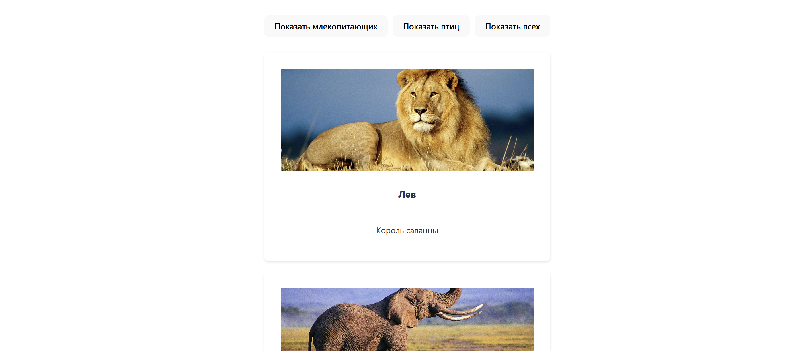

# Карточки животных

React приложение для отображения карточек с информацией о животных с возможностью фильтрации по категориям.

## Функциональность

- Отображение карточек животных с фото, названием и описанием
- Фильтрация животных по категориям (млекопитающие, птицы)
- Адаптивный дизайн с красивыми тенями и анимациями
- Быстрая загрузка благодаря Vite

### Установка зависимостей
```bash
npm install
```

